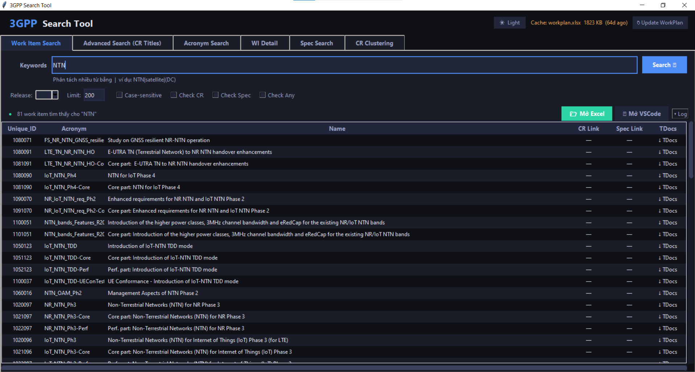
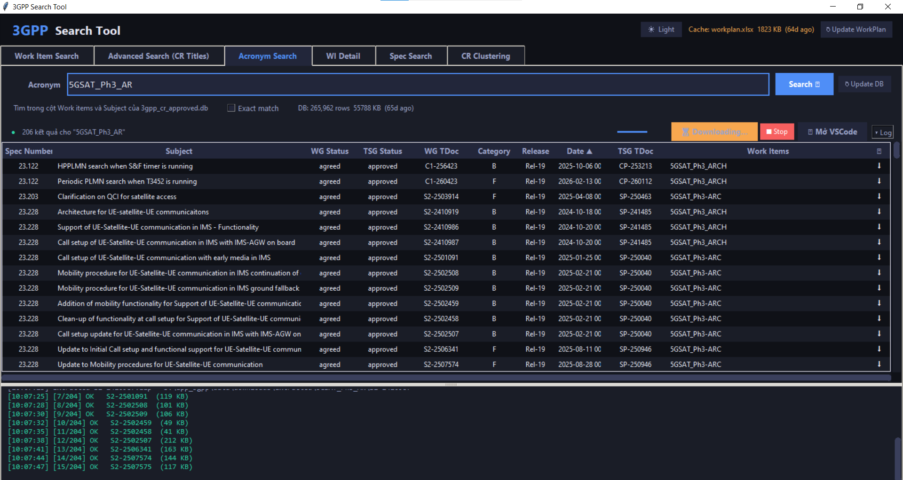
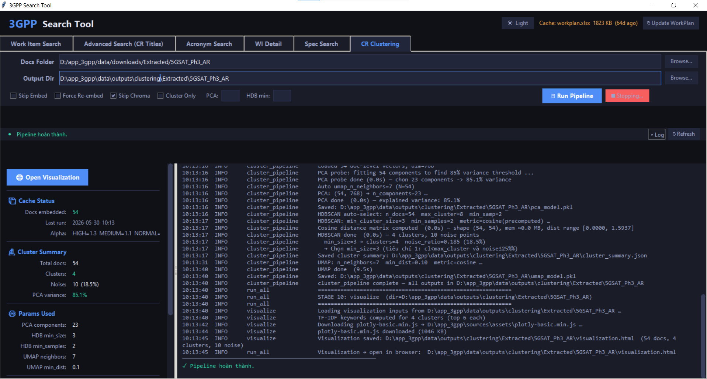
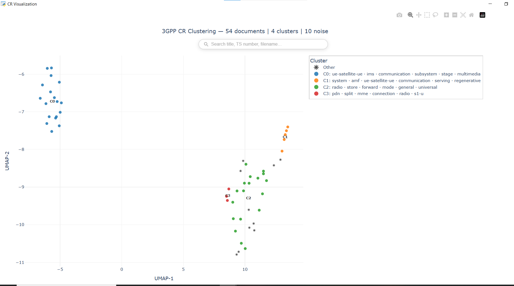

# 3GPP Search Tool

> A Windows desktop application for searching, analyzing, and semantically clustering 3GPP standardization documents — Change Requests (CRs), Work Items (WIs), and Technical Specifications (TSs). (Vibe coding)


---

## Overview

3GPP publishes thousands of technical documents across hundreds of Work Items and Releases each year. Finding relevant Change Requests, understanding their scope, and clustering similar CRs by topic is a slow, manual process for engineers and researchers.

**3GPP Search Tool** automates the entire workflow in a single desktop app:

- Keyword search on the official 3GPP Work Plan
- Full-text search across CR titles (offline SQLite FTS5)
- Approved CR lookup with metadata (spec, meeting, status)
- Bulk TDoc download + structured metadata extraction from `.docx`/`.doc` files
- End-to-end ML pipeline: **BGE embeddings → PCA → HDBSCAN → UMAP → interactive Plotly visualization**
- Natural-language semantic search via **ChromaDB-backed RAG**

---

## Demo

<!-- TODO: Add screenshots/GIF here -->





---

## Key Features

| # | Feature | Description |
|---|---------|-------------|
| 1 | **6-tab GUI** | with dark/light theme toggle |
| 2 | **Work Item Search** | keyword search on `workplan.xlsx`, with optional parallel CR/Spec existence checks |
| 3 | **Advanced CR Title Search** | SQLite FTS5 full-text search with OR, phrase, and wildcard syntax |
| 4 | **Approved CR Search** | filter and browse CRs with TSG-level "Approved" status |
| 5 | **WI Detail / TDoc Lookup** | fetch and process all agreed TDocs for a given Work Item |
| 6 | **Spec Search** | browse Technical Specifications linked to Work Items |
| 7 | **CR Clustering** | full ML pipeline: BGE embeddings → PCA → HDBSCAN → UMAP → interactive HTML visualization |
| 8 | **Semantic RAG Search** | ChromaDB-backed retrieval for natural language CR queries |
| 9 | **Smart caching** | ocal cache for workplan, Excel files, downloaded ZIPs, embeddings |

---

## Tech Stack

**Core** — Python 3.9–3.13 · Tkinter/ttk · `pythonw.exe` (console-less launch)

**Data & Search** — SQLite (FTS5) · openpyxl · pandas · requests · BeautifulSoup4

**Document Processing** — python-docx · olefile (legacy `.doc` OLE2) · lxml

**ML / AI** — sentence-transformers (BAAI/bge-base-en-v1.5) · scikit-learn (PCA) · hdbscan · umap-learn · chromadb · plotly

**Infrastructure** — pywebview (subprocess) · PowerShell setup · Pillow (icon generation)

---

## Architecture

Three logical layers with clean separation of concerns:

```
┌──────────────────────────────────────────────────────────────┐
│                        GUI Layer                             │
│   app.py  ←→  ui_tabs.py  ←→  ui_tabs_rag.py                 │
│   widgets.py  (custom Tkinter components)                    │
├──────────────────────────────────────────────────────────────┤
│                   Business Logic Layer                       │
│   workplan.py   cr_search.py   acr_db.py                     │
│   tdoc.py       cr_extractor.py    heading_extractor.py      │
│   ts_info_db.py                                              │
├──────────────────────────────────────────────────────────────┤
│                    ML / AI Pipeline Layer                    │
│   embed_pipeline.py   cluster_pipeline.py   rag_query.py     │
│   run_all.py   visualize.py                                  │
└──────────────────────────────────────────────────────────────┘
```

`App` uses **multiple inheritance** (`tk.Tk` + `TabsMixin` + `ClusterTabsMixin`) so tab-specific UI code lives in dedicated files while sharing one event loop and one state object.

Full architecture and module breakdown: [PROJECT_DOCUMENTATION.md](./PROJECT_DOCUMENTATION.md)

---

## Engineering Highlights

A few design decisions worth calling out:

- **Lazy dependency loading** — `config.py` uses `importlib.util.find_spec()` to check optional packages without importing them. Heavy ML packages (`sentence_transformers`, `chromadb`, `pandas`) are imported only inside the functions that need them. Result: instant startup and a graceful reduced-feature mode when ML deps are missing.

- **Threading model for a responsive UI** — All network I/O and file processing runs on daemon threads. UI updates are always marshalled back to the main thread via `self.after(0, cb)`, respecting Tkinter's single-thread requirement while keeping the GUI frame-perfect.

- **Two-tier embedding cache** — Chunk-level vectors (Tier 1) are separated from document-level weighted vectors (Tier 2). When only alpha weighting constants change, document vectors are recomputed from cached chunks in seconds — no BGE model call needed. Alpha values are snapshotted to detect changes across runs.

- **HDBSCAN auto-tuning** — Instead of exposing `min_cluster_size` as a raw knob, the pipeline runs HDBSCAN at sizes 3 and 4, then applies a 5-criterion decision tree on cluster count and noise ratio. Reasonable clustering across very different corpus sizes with no manual tuning.

- **pywebview via subprocess** — `pywebview.start()` requires the main thread, which Tkinter already owns. The helper spawns a fresh Python process and pipes the inline script through `stdin`, passing the HTML path through an environment variable to keep `stdin` free.

- **Tiered Markdown output** — TDoc summaries auto-select Full / Medium / Compact detail levels based on document count, keeping output token-efficient for downstream LLM consumption.

- **Shared ZIP cache** — Downloaded TDoc ZIPs are stored under `data/downloads/Zip/<LETTER>/`, organized by first character. Subsequent downloads of the same file are zero-HTTP.

---

## Folder Structure

```
app_3gpp/
├── Tao_Shortcut_Desktop.bat        # Windows shortcut creator
├── _setup.ps1                      # PowerShell: deps check + Desktop shortcut
├── icon.ico
│
├── app.py                          # Entry point: App(tk.Tk) + theme engine
├── config.py                       # Global constants, paths, themes, fonts
├── ui_tabs.py                      # TabsMixin: UI + handlers for Tabs 1–5
├── ui_tabs_rag.py                  # ClusterTabsMixin: UI + handlers for Tab 6
├── widgets.py                      # SmoothScrollbar, PulseBar, FindBar
│
├── workplan.py                     # 3GPP WorkPlan: download, search, export
├── cr_search.py                    # CR titles FTS5 search + file download
├── acr_db.py                       # Approved CR DB builder (ZIP → Excel → SQLite)
├── tdoc.py                         # TDoc download pipeline + CR text extraction
├── cr_extractor.py                 # CR metadata extractor (.docx / .doc)
├── heading_extractor.py            # Heading extractor (track-change-aware)
├── ts_info_db.py                   # TS spec title lookup (SQLite)
│
├── embed_pipeline.py               # ML: extract → chunk → embed → store
├── cluster_pipeline.py             # ML: PCA → HDBSCAN → UMAP
├── rag_query.py                    # RAG semantic search (ChromaDB)
├── run_all.py                      # ML pipeline orchestrator (CLI + GUI)
├── visualize.py                    # UMAP coords → Plotly HTML
├── webview_helper.py               # Spawn pywebview subprocess
└── make_icon.py                    # Pillow → icon.ico
```

Auto-created at runtime: `.cache/`, `data/downloads/`, `data/outputs/`, `excels/`, `models/`.

---

## Getting Started

### Prerequisites
- **Python 3.9–3.13** (Windows)
- Optional: Download BGE embedding model bge-base-en-v1.5 and put it at `models/bge-base-en-v1.5/` (for Tab 6 / RAG)

### Quick setup (Windows)

```bat
Tao_Shortcut_Desktop.bat
```

Locates `pythonw.exe`, installs dependencies, creates a Desktop shortcut.

### Manual setup

```bash
# Core GUI
pip install openpyxl requests beautifulsoup4 python-docx olefile pandas

# ML pipeline (Tab 6)
pip install numpy scikit-learn sentence-transformers transformers umap-learn hdbscan chromadb

# Visualization
pip install pywebview
```

### Run

```bash
python app.py            # with console (shows logs)
pythonw app.py           # console-less (clean launch)
```

### ML pipeline (CLI)

```bash
# Full: embed → cluster → visualize
python run_all.py --root ./data/cr_docs --out ./data/outputs/clustering

# Skip embedding, re-cluster only
python run_all.py --skip-embed --pca 30 --hdb-min-size 5

# Regenerate visualization only
python run_all.py --only-viz --out ./data/outputs/clustering
```

### RAG search (CLI)

```bash
python rag_query.py "IMS data channel enhancements" --top 10
python rag_query.py "NTN handover LEO" --group HIGH --work-item NR_NTN
```

---

## External Data (not included)

| File | Source | Location |
|------|--------|----------|
| `workplan.xlsx` | Auto-downloaded from 3GPP | `.cache/workplan.xlsx` |
| `cr_titles.db` | External `cr_indexer.py` tool | `.cache/cr_titles.db` |
| `ts_info.db` | External TS metadata tool | `.cache/ts_info.db` |
| `bge-base-en-v1.5/` | [Hugging Face](https://huggingface.co/BAAI/bge-base-en-v1.5) | `models/bge-base-en-v1.5/` |

---

## Documentation

- [PROJECT_DOCUMENTATION.md](./PROJECT_DOCUMENTATION.md) — full module breakdown, execution flow, design rationale

---

